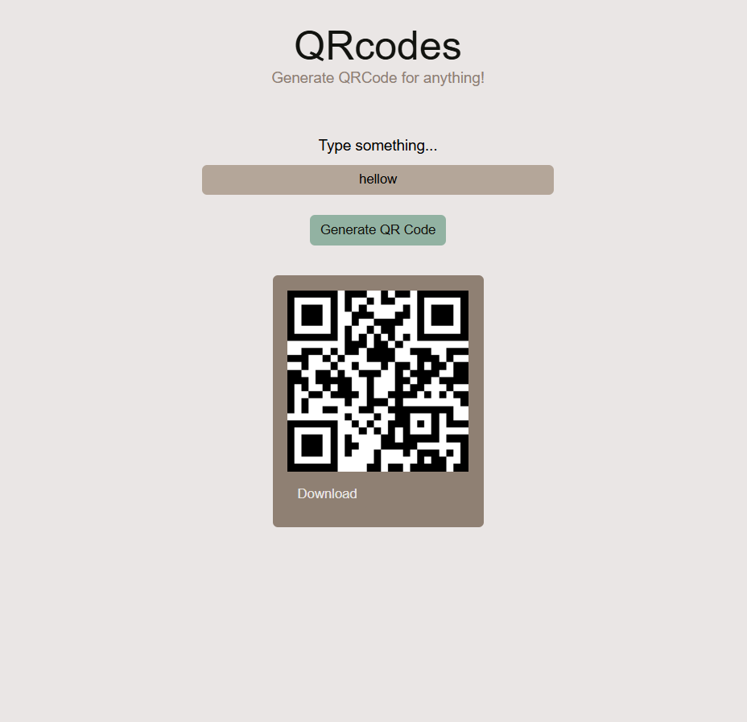

📄 README.md
# QR Code Generator

A simple web-based **QR Code Generator** built with **HTML, CSS, and JavaScript**.  
It allows users to enter any text or URL, generate a QR code, and download it as an image.

---

## 🚀 Features
- Generate QR code for any text or URL.
- Clean and responsive UI with custom styling.
- Option to **download the QR code** as a PNG file.
- Built using **qrcode.js** library.

---

## 📂 Project Structure


QR-code-/

│── index.html # Main HTML file

│── style.css # Styling for the app

│── script.js # QR code generation logic


---

## 🛠️ How to Use
1. Clone the repository:
   ```bash
   git clone https://github.com/sud-git/QR-code-.git


Open the project folder:

cd QR-code-


Open index.html in your browser.

🌐 Live Demo


project will be live at:

https://sud-git.github.io/QR-code-/

📸 Screenshot

Add a screenshot here if you want



📚 Tech Stack

HTML5

CSS3

JavaScript

QRCode.js

🤝 Contributing

Contributions, issues, and feature requests are welcome!
Feel free to fork this repo and create a pull request.